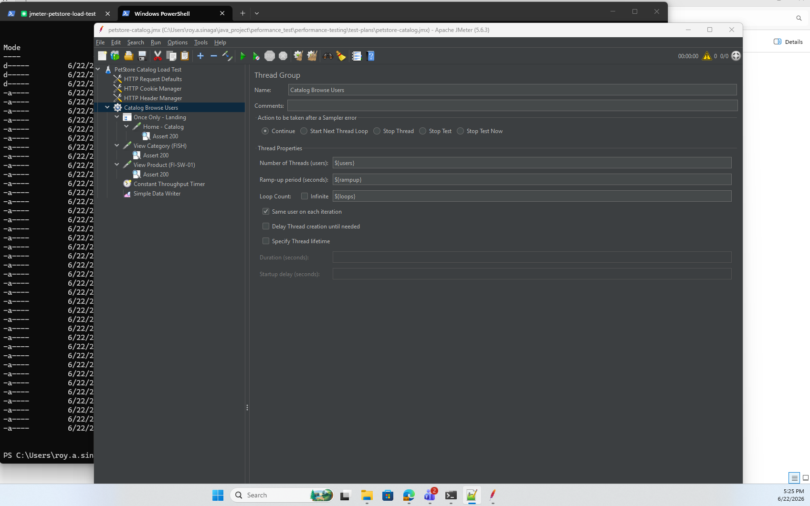

# performance-testing

Repo for performance testing.

## PetStore Catalog Load Test (JMeter)



Load test for the OctoPerf JPetStore catalog at
`https://petstore.octoperf.com/actions/Catalog.action`.

### Layout

```
test-plans/petstore-catalog.jmx   Parameterized JMeter test plan
scripts/run-test.bat              Windows runner
scripts/run-test.sh               POSIX / CI runner
results/                          Run output (JTL + HTML dashboard), gitignored
k6/                               k6 implementation of the same test (see k6/README.md)
```

A k6 version of this test (same browse flow and load levels) lives in
[`k6/`](k6/README.md) for those who prefer k6 over JMeter.

### Prerequisites

- Apache JMeter 5.6.3, installed at
  `C:\Users\roy.a.sinaga\application\apache-jmeter-5.6.3\apache-jmeter-5.6.3`.
  Edit `JMETER_HOME` at the top of the run scripts if your path differs
  (or set the `JMETER_HOME` env var for `run-test.sh`).
- Java 8+ on the `PATH` (required by JMeter).

### Scenario

Each virtual user runs a browse flow:

1. **Once only** — `GET /actions/Catalog.action` (landing/home)
2. **Per loop** — `GET …?viewCategory=&categoryId=FISH`
3. **Per loop** — `GET …?viewProduct=&productId=FI-SW-01`

So each user issues `1 + 2 × loops` requests = **21 requests** at the default
loop count of 10. Throughput is paced by a Constant Throughput Timer (shared
across all threads) so the aggregate TPS lands near the target for each level.

### Load levels

| Level | Users | Loops | Target TPS | Total samples |
|-------|-------|-------|------------|---------------|
| 30    | 30    | 10    | ~0.50      | 630           |
| 40    | 40    | 10    | ~0.70      | 840           |
| 50    | 50    | 10    | ~0.80      | 1050          |
| 70    | 70    | 10    | ~1.20      | 1470          |

`Total samples = users × 21`. The 70-user run is also the error baseline
(6 connection timeouts ≈ 0.41% error rate).

> Because target TPS is low, a full level run is paced to roughly ~20 minutes.

### Running

Windows:

```bat
scripts\run-test.bat 30      :: one level (630 samples, ~0.5 TPS)
scripts\run-test.bat 70      :: 1470 samples, ~1.2 TPS
scripts\run-test.bat all     :: 30, 40, 50, 70 back to back
scripts\run-test.bat 30 1 5  :: quick smoke: 1 loop, 5s ramp (30*3 samples)
```

POSIX / Git Bash:

```bash
scripts/run-test.sh 30
scripts/run-test.sh all
scripts/run-test.sh 30 1 5   # quick smoke
```

Arguments: `<level> [loops] [rampup]` — level is `30|40|50|70|all`,
loops defaults to `10`, ramp-up defaults to `30` seconds.

### Output

Each run writes a timestamped folder under `results/`, e.g.
`results/30users-20260622-103000/`, containing:

- `result.jtl` — raw sample log (CSV)
- `html/index.html` — JMeter HTML dashboard report
- `jmeter.log` — JMeter run log

### Parameters (override via `-J`)

The plan can also be driven directly with JMeter properties:

```bat
jmeter -n -t test-plans\petstore-catalog.jmx ^
  -Jusers=50 -Jloops=10 -Jtpm=48 -Jrampup=30 ^
  -l results\result.jtl -e -o results\html
```

| Property   | Default                  | Meaning                                   |
|------------|--------------------------|-------------------------------------------|
| `users`    | 30                       | Concurrent threads                        |
| `loops`    | 10                       | Loop count                                |
| `tpm`      | 30                       | Constant throughput, **samples/minute** (TPS × 60) |
| `rampup`   | 30                       | Ramp-up seconds                           |
| `host`     | petstore.octoperf.com    | Target host                               |
| `protocol` | https                    | Target protocol                           |
